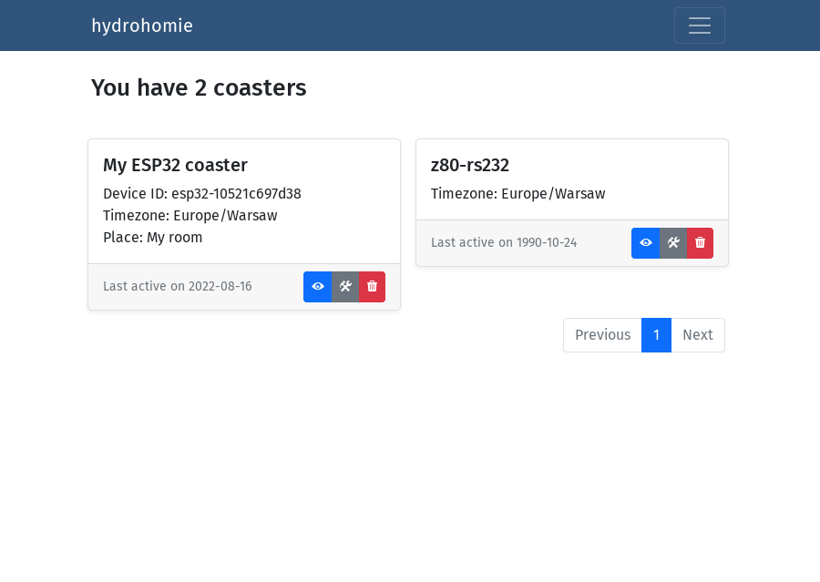
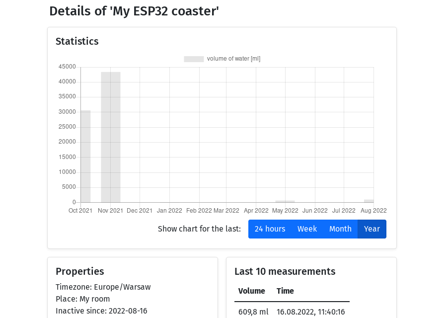

# hydrohomie - web application

[](https://github.com/kmolski/hydrohomie/actions)
[](https://github.com/kmolski/hydrohomie/actions/workflows/gradle.yml)

Companion web app for the smart coaster device, built with Java 17 and open-source tools.

This application is entirely optional. The smart coaster can function without it, although with
slightly limited functionality (e.g. no measurement/daily total persistence between device restarts).

For more details about the application structure, view the [JavaDocs](../docs/index.html).

<p style="text-align: center;">
<table style="padding: 0px; border-spacing: 0px;">
    <tr>
        <th scope="col"></th>
        <th scope="col"></th>
    </tr>
    <tr>
        <th scope="col">Coaster management</th>
        <th scope="col">Coaster details view</th>
    </tr>
</table>
</p>

Configuration
-------------

| Environment variable | Spring property name | Default value | Description                  |
|----------------------|----------------------|---------------|------------------------------|
| `ADMIN_USER`         | `admin.username`     | _(none)_      | Admin account username       |
| `ADMIN_PASS`         | `admin.password`     | _(none)_      | Admin account password       |
| `MQTT_URL`           | `mqtt.url`           | _(none)_      | MQTT broker URL              |
| `MQTT_CLIENT_ID`     | `mqtt.client-id`     | `backend`     | MQTT client ID prefix        |
| `MQTT_TOPIC`         | `mqtt.topic`         | `hydrohomie`  | MQTT topic prefix            |
| `DB_HOST`            | _(none)_             | _(none)_      | PostgreSQL instance hostname |
| `DB_NAME`            | _(none)_             | _(none)_      | PostgreSQL database name     |
| `DB_USER`            | _(none)_             | _(none)_      | PostgreSQL account username  |
| `DB_PASS`            | _(none)_             | _(none)_      | PostgreSQL account password  |

Quick setup with docker-compose
-----------

### Build Docker container

```cmd
$ ./gradlew bootBuildImage
```

### Run with docker-compose

__This method uses `admin/admin` as the default admin account credentials.__

```cmd
$ docker-compose up -d
```

The application will be available at `http://localhost:8080`.

First steps
-----------

1. Log in with the admin account
2. Create a new application user 
3. Turn the coaster on & go to the "Coasters" tab
4. Click "Assign" to start the assignment procedure
5. Choose the user account to assign the coaster to
6. Log in with the application user account

Dependencies
------------

- [Spring Boot](https://spring.io/projects/spring-boot) - configuration & monitoring
- [Spring WebFlux](https://docs.spring.io/spring-framework/docs/current/reference/html/web-reactive.html) - reactive Web MVC framework
- [Spring Security](https://spring.io/projects/spring-security) - authentication & access control
- [Spring Integration](https://spring.io/projects/spring-integration) + [Paho client](https://www.eclipse.org/paho) - MQTT communication
- [Thymeleaf](https://www.thymeleaf.org) + [Bootstrap](https://getbootstrap.com) - HTML templates & CSS framework
- [Spring Data R2DBC](https://spring.io/projects/spring-data-r2dbc) + [PostgreSQL](https://www.postgresql.org) - object mapper & RDBMS
- [JUnit 5](https://junit.org/junit5) + [Mockito](https://site.mockito.org) - integration & unit test tools
- [Testcontainers](https://www.testcontainers.org) - containers for integration tests
- [Liquibase](https://www.liquibase.org) - database migration tool
- [Lombok](https://projectlombok.org) - code generation library

License
-------

[MIT License](https://opensource.org/licenses/MIT)
